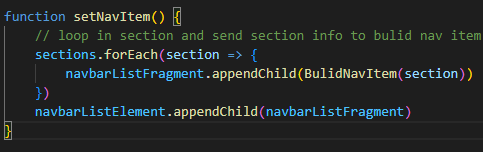

# Project Structure 
- css
    > styles.css
- js
    > app.js
- img
    > imgs
- index.html

# Aim
  - Apply JavaScript conspet
  - Apply Dom Structur Rection
  - Apply High Performance Implemntation
  - Apply Basic writing and formatting syntax

# System digram
## built dynamically Navigation     
  - requirment 
    + Sections 
        > select all html element Section  
        >
            const sections = document.querySelectorAll('section')
    + Nav 
        > List Container to Set dynamicall nav on it
        >  
            const navbarListElement = document.getElementById("navbar__list")
    + Fragment 
        > For High Perfomance
        >
            const navbarListFragment = document.createDocumentFragment()

- implemntaion
    
    ```mermaid
    graph TD;
        setNavItem-->loopThrowSection;
        loopThrowSection-->bulidNavItem;
        bulidNavItem-->loopThrowSection;
        loopThrowSection-->addToFrgment;
    ```
        ```mermaid
        graph TD;
            addToFrgment-->AddToNavBar;
        ```

  + setNavItem Function    
      > Loop Throw All Sections to implement dynamic buliding then add the result to navbar
      > 
        sections.forEach(section => {
            navbarListFragment.appendChild(BulidNavItem(section))
        })
        navbarListElement.appendChild(navbarListFragment)  
  + BulidNavItem ()     
    > return with list Item 
    >   
        const listItem = document.createElement('li');
        const link = document.createElement('a');
        // set link Value From data-nav attribute in section
        link.textContent = section.getAttribute('data-nav')
        // set class menu__link to link for active style
        link.classList.add("menu__link")
        // set link Event that move to section in scroll depend on the section offset from top
        link.addEventListener('click', () => {
            section.scrollIntoView({ behavior: "smooth", });
        });
        // append link to listItem
        listItem.appendChild(link)
        navList.push(listItem)
        return listItem

## active section and nav Item when scrolling in viewport of this section
    - requirment
        - section position 
        - real position while Scrolling
        - navItems
        - Sections
    
    implemntaion 
        --> getSectionsViewPort() -----------> loop IN Section and return with object contain required info of viewport 
                                                {offsetTop,offsetHight} add it to SectionsViewPort[]
        --> oldPointer //refer to Active Element Number ------------------------------\___
        --> onWindowsScroll()                                                             |
            --> addEventScroll()                                                          |
                --> activeSectionAndNav()                                                 |
                    -->loop Throw sectionsViewPort to detect which section Iam in         |
                        -->changeActivationPosition(NewPointer)                           |
                            newPointer isEqual(oldPointer) _______________________________|      
                                                |
        sectionNotChange Do Nothin<--\___true___|___false____/----->\___ 
                                                                        |
                                                                        |__/--> add active [newPointer]  
                                                                        |__/--> remove active [oldPointer]  
                                                                        |__/--> oldPointer assign [newPointer]  


    3-
        - Proplem
            - add arrow scroll up when u scroll down

        - requirment 
            - scrollUp button 
            - method to hide and show and active event on click
        
        - implementaion
            - scrollUpObject -->|____/--> get element by dom
                                |____/--> hide() remove class show
                                |____/--> show() add class show
                                |____/--> setEvent() add event click with method scroll up
            - scrollupObject.setEvent()
            - show and hide in onWindowScroll()