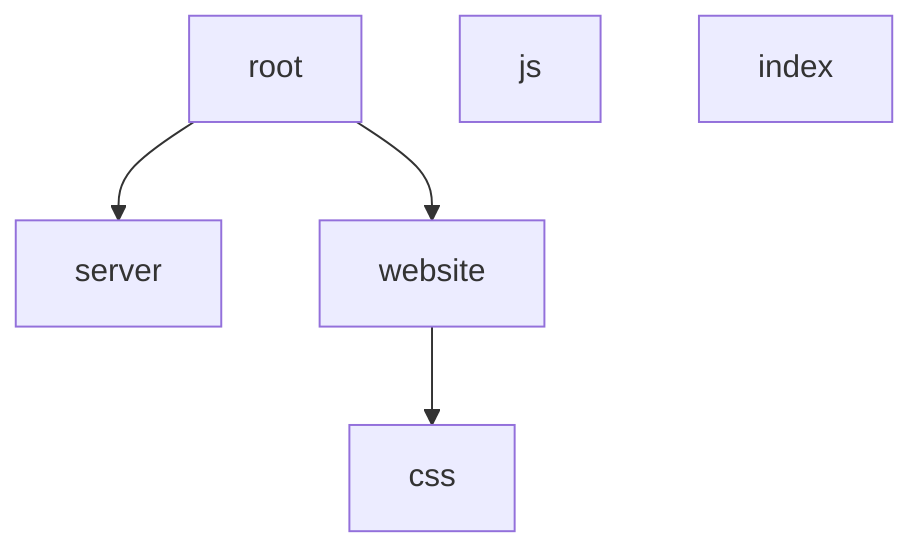

# Weather-Journal App Project

## Overview
- app:/n
Asynchronous Wep Application Use web ApI . 
- Server :
use Node Js Express environment to develop a web application and bulid routing 

## System structure 

## Extras
If you are interested in testing your code as you go, you can use `tests.js` as a template for writing and running some basic tests for your code.
