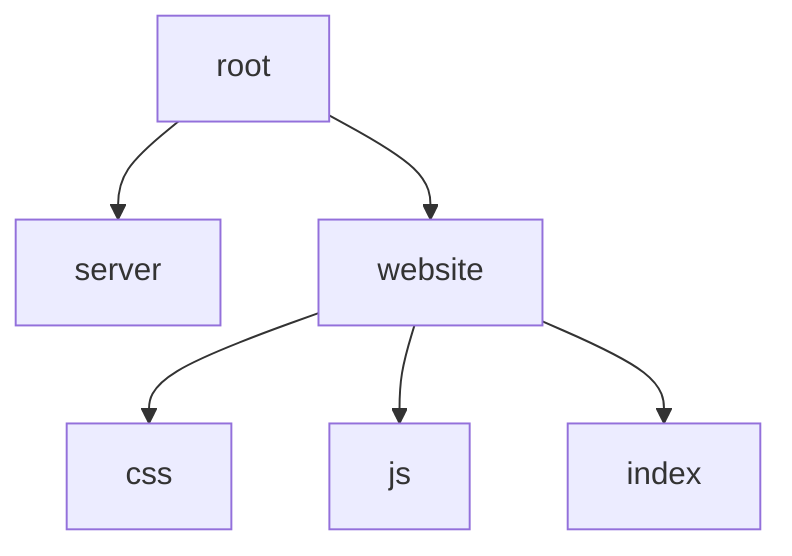
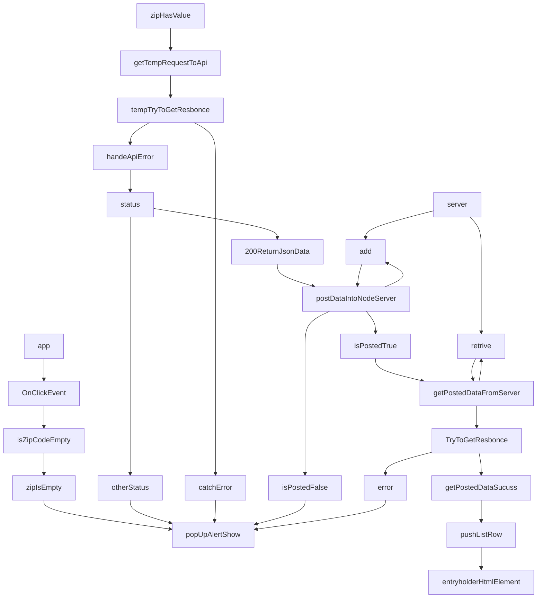

# Weather-Journal App Project

## Overview
- app: Asynchronous Wep Application Use web ApI . 
- Server: use Node Js Express environment to develop a web application and bulid routing 
- project is upload with nodejs server requirment after download run server
    >
        node server.js
    it while open in port 8000
## project structure 

## System Flow Digram 

